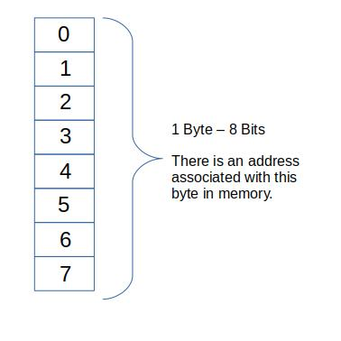

# **C Programming**

## Contents:  
1.0  Basics  
2.0 
## **Compiling C in Linux** 
```
gcc file.c 
./a.out
```
## **1.0 Basics** 
### **1.1 Commenting, `printf`, `scanf`, syntax in C** 
```c
/*
 * Multi-Line Commenting Style 
 */
#include <stdio.h>
int main()
{
	printf("Hello World.\n");
	//Single-line comments 
	
	char str[100];
	int i;
	
	printf("Enter a Dollar Cost Value X ending with $ : ");
	scanf("%d %s", &i, str);
	printf("You entered: %d %s\n",i,str);
	
	return 0;
}
```
<p align="center">Listing 1.1: Basics in C</p>  

```
Hello World.  
Enter a Dollar Cost Value X ending with $ : 25 $
You entered: 25 $
```
<p align="center">Listing 1.1 Output: Basics in C</p>  

### **1.2 Preprocessor:** 
- Part of C compilation process that recognizes special statements such as `#include`.
- Compiler analyzes these statements to do something before compiling the source code.
- Preprocessor statements are identified with `#` sign and can be placed anywhere in the code.
- Preprocessor statements can be used to create:
  - constants and macros with the `#define` statement, 
  - build library files with `#include` statement 
  - write programs with conditional `#ifdef`, `#endif`, `#else`, and `#ifndef` statements 
- With `#include<stdio.h>`, compiler is instructed to include the contents of the file `stdio.h`
### **1.3 Header Files:** 
- Header files contain information about some of the functions that are provided by that file.
- Header files allow code to be reused.
- Using angle bracket  `#include<myCode.h>` tells the preprocessor to search for the file in one or more standard system directories.
- Using double quotes `"include<myCode.h>"` tells the preprocessor to search in the current directory.
- Example: `#include<stdio.h>`, is a standard C library header and provides functionality for displaying output among other functional features.
### **1.4 Data Types:** 
- `int`, `float`, `double`, `char`, `bool` (C99), `_Bool`
- Difference between data types is in amount of memory they occupy and the range of values they can hold. 
- The amount of storage that is allocated to store a particular type of data is architecture dependent. 
- A bit is 0 or 1.
- 1 Byte equals eight bits and each byte is labelled with an address. 
- The address of a byte uniquely references that byte on computer's memory. 
- **Word** is the amount of data that a machine can process at one time or in each cycle. n-bits of a machine is generally referred to as the machine's word size. For example, a processor with 32-bits will have word size of 32-bits.

### **1.4.1 int:** 
- Type ``int`` variable does not contain decimal values. 
- Default ```int``` in C are signed, which means they can be both negative and positive.  
- Unsigned values do not allow negative numbers. Both ```signed``` and ```unsigned int``` values are saved to memory in binary.  
- For ```signed int```, the most significant bit marks the value to be positive or negative.
- Positive ```signed``` values are stored in the same way as ```unsigned values```, but negative numbers are stored using two’s complement method.  
- To write negative value in binary, first write positive number, next invert all the bits and last add 1.   
- The most significant impact of the processors bit architecture i.e., 8bit, 16bit, 32bit, 64bit is how you need to most efficiently store each byte of information in order to best compute variables in the **minimum number of cycles**. The bit size of your processor tells you what the natural word length the CPU is capable of handling in one cycle. A 32bit machine needs 2 cycles to handle a 64bit double if it is aligned properly in memory. Most personal computers were and still are 32bit hence the most likely reason for the C compiler typical affinity for 32bit integers with options for larger floating point numbers and long long ints. Clearly you can compute larger variable sizes so in that sense the CPU's bit architecture determines how it will have to store larger and smaller variables in order to achieve best possible efficiency of processing but it is in no way a limiting factor in the definitions of byte sizes for ```int``` or ```char```, that is part of compilers' and what is dictated by convention or standards.

Binary representation:  
a) 16 = 0001 0000b  
b) -16 :  
   Invert all bits in 16: 1110 1111b

### **1.4.2 float:** 
- ```float``` variables can be used to store values containing decimal values 
- Example: 9., 987.21, -0.0023
- Floating point constants can be expressed in scientific notation such as gravitational constant: ```6.674e-11``` which represents the value 6.674 x 10<sup>-11</sup>
### **1.4.3 double:** 
- Same as type ```float```, but with twice the precision, most computers represent double values as 64 bits 
- Can be used when the range provided by a ```float``` variable is not sufficient as ```double``` can store twice the significant digits 
- Floating point constants are taken as double values by C compiler and to explicitly express a float constant, append either an ```f``` and ```F``` to the end of the number like ```9.8f``` 
### **1.4.4 bool:** 
- ```bool``` (C99 needs ```#include<stdbool.h>```) or ```_Bool``` data type stores just the values 0 or 1 – can be used to indicate binary choices - on/off, yes/no, or true/false situation.  
- 0 is used to indicate a false value, 1 is used to indicate a true value. 


<p align="center">  </p>
<p align="center">Figure 1.1 Snapshot of a byte in memory</p>  

| Specifier | Used For                                           |
| :-------- | :------------------------------------------------- |
| %c        | a single character                                 |
| %s        | a string                                           |
| %hi       | short (signed)                                     |
| %hu       | short (unsigned)                                   |
| %Lf       | long double                                        |
| %n        | prints nothing                                     |
| %d        | a decimal integer (assumes base 10)                |
| %i        | a decimal integer (detects the base automatically) |
| %o        | an octal (base 8) integer                          |
| %x        | a hexadecimal (base 16) integer                    |
| %p        | an address (or pointer)                            |
| %f        | a floating point number for floats                 |
| %u        | int unsigned decimal                               |
| %e        | a floating point number in scientific notation     |
| %E        | a floating point number in scientific notation     |
| %%        | the % symbol                                       |
<p align="center">Table 1:Print Specifiers (taken from freeCodeCamp)</p> 

### **1.5: Print Specifiers** 
