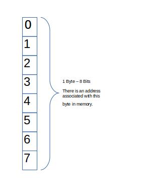

# **C Programming**

## Contents:  
1.0  Basics  
2.0 
## **Compiling C in Linux** 
```
gcc file.c 
./a.out
```
## **1.0 Basics** 
### **1.1 Commenting, `printf`, `scanf`, syntax in C** 
```c
/*
 * Multi-Line Commenting Style 
 */
#include <stdio.h>
int main()
{
	printf("Hello World.\n");
	//Single-line comments 
	
	char str[100];
	int i;
	
	printf("Enter a Dollar Cost Value X ending with $ : ");
	scanf("%d %s", &i, str);
	printf("You entered: %d %s\n",i,str);
	
	return 0;
}
```
<p align="center">Listing 1.1: Basics in C</p>  

```
Hello World.  
Enter a Dollar Cost Value X ending with $ : 25 $
You entered: 25 $
```
<p align="center">Listing 1.1 Output: Basics in C</p>  

### **1.2 Preprocessor** 
- Part of C compilation process that recognizes special statements such as `#include` 
- Compiler analyzes these statements to do something before compiling the source code
- Preprocessor statements are identified with `#` sign and can be placed anywhere in the code
- Preprocessor statements can be used to create:
  - constants and macros with the `#define` statement, 
  - build library files with `#include` statement 
  - write programs with conditional `#ifdef`, `#endif`, `#else`, and `#ifndef` statements 
- With `#include<stdio.h>`, compiler is instructed to include the contents of the file `stdio.h`
### **1.3 Header Files** 
- Header files contain information about some of the functions that are provided by that file 
- Header files allow code to be reused
- Using angle bracket  `#include<myCode.h>` tells the preprocessor to search for the file in one or more standard system directories 
- Using double quotes `"include<myCode.h>"` tells the preprocessor to search in the current directory 
- Example: `#include<stdio.h>`, is a standard C library header and provides functionality for displaying output among other functional features 
### **1.4 Data Types** 
- `int`, `float`, `double`, `char`, `bool` (C99), `_Bool`
- Difference between data types is in amount of memory they occupy and the range of values they can hold 
- The amount of storage that is allocated to store a particular type of data is architecture dependent 
- A bit is 0 or 1
- 1 Byte equals eight bits and each byte is labelled with an address 
- The address of a byte uniquely references that byte on computer's memory 
<p align="center">  </p>
<p align="center">Figure 1.1 Snapshot of a byte in memory</p>  

| Type Name    | Bytes | Other Names | Range of Values           |
| :----------- | :---- | :---------- | :------------------------ |
| int          | 4     | signed      | -2147483648 to 2147483647 |
| unsigned int | 4     | unsigned    | 0 to 4294967295           |
